# Student Hall Management System

Undergraduate Project Based on Java, JavaFX

Residential Student Hall/Mess Management System Desktop JavaFX Application

## Project Team

- **Asswad Sarker Nomaan (ID: 160101006)**
- **Mst. Monakkara Begum (ID: 160101026)**
- **Abdullah Al Baki (ID: 160101004)**

Department of Computer Science & Engineering (CSE)

Bangladesh Army University of Science & Technology (BAUST)

## Screenshots

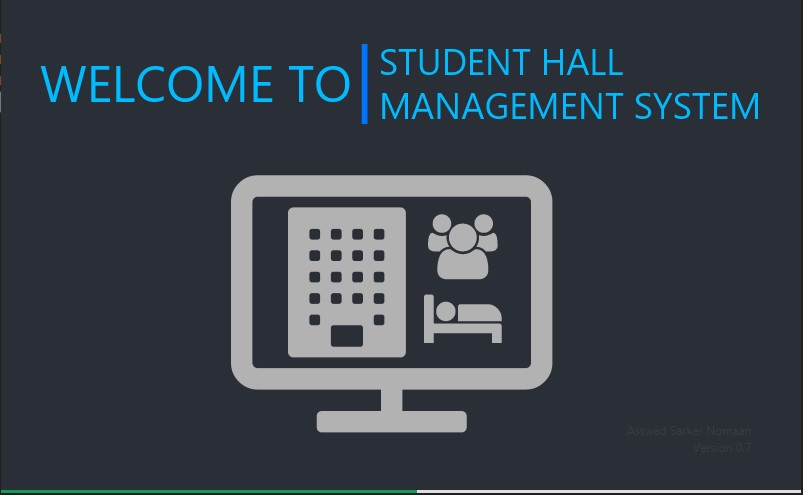
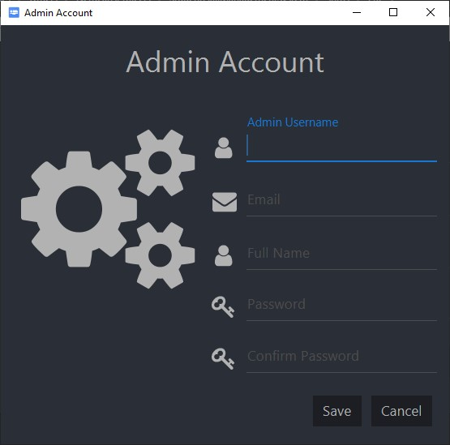
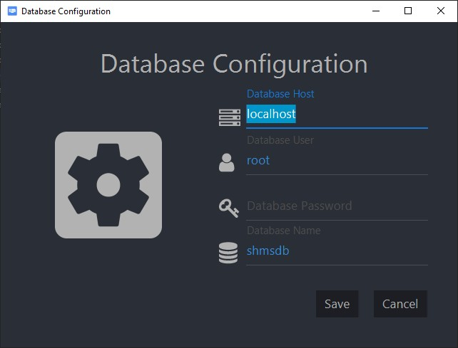
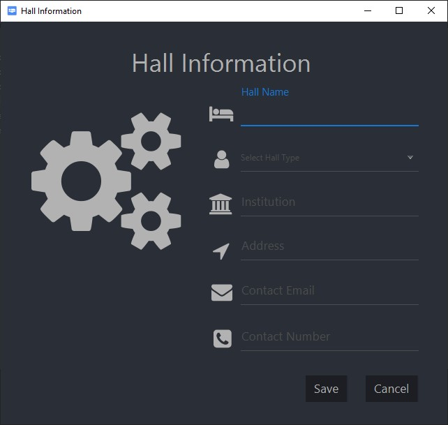
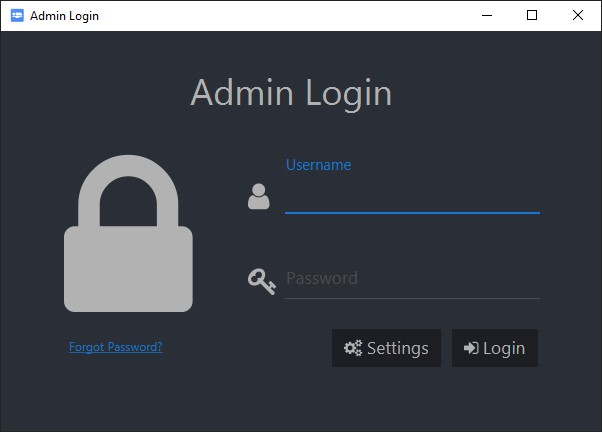
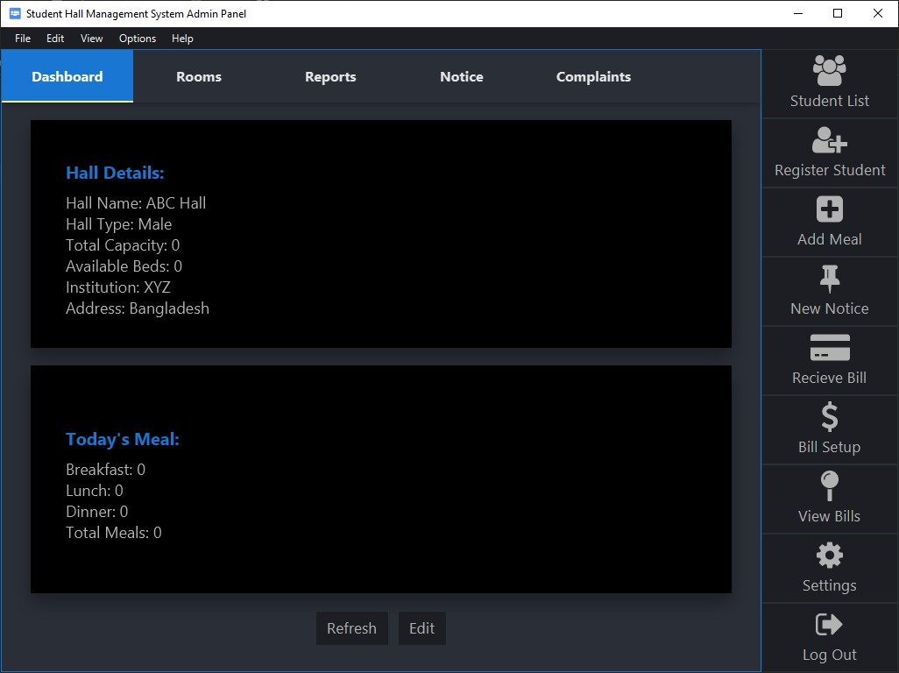
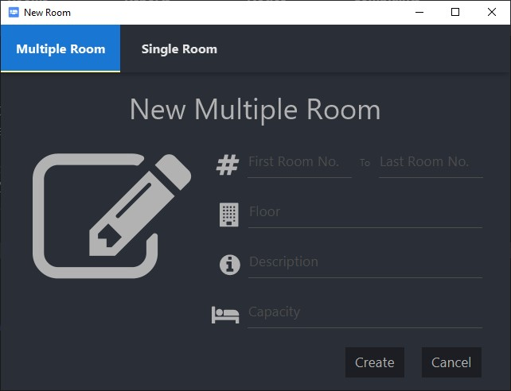
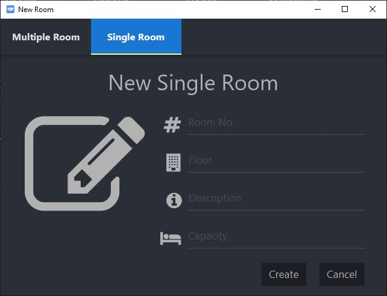
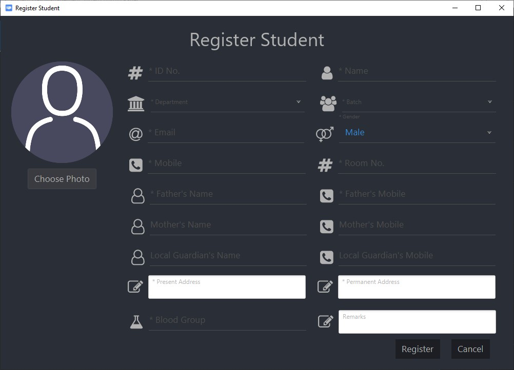
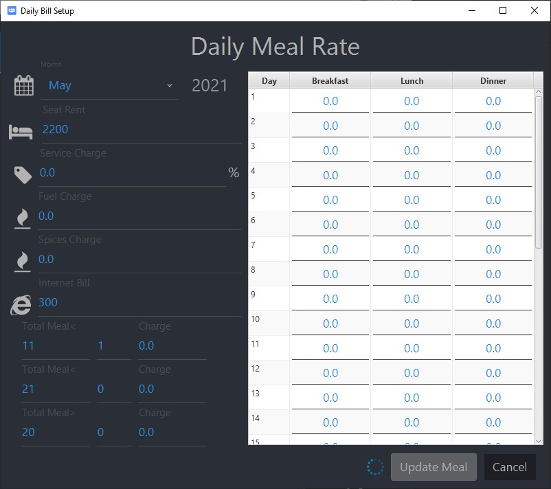
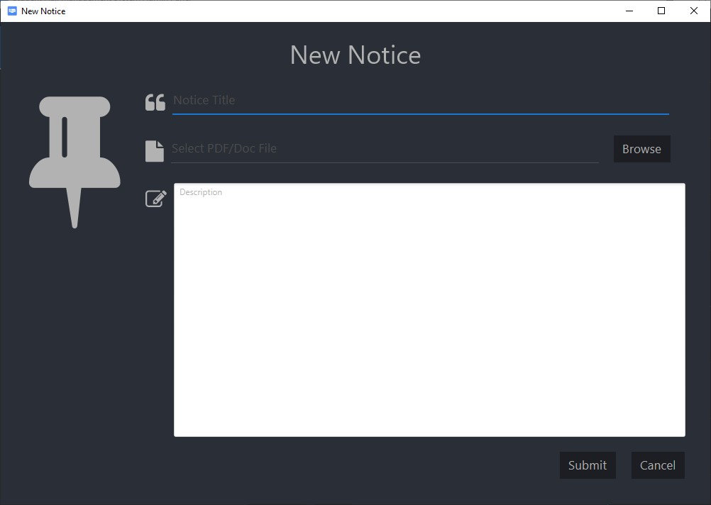
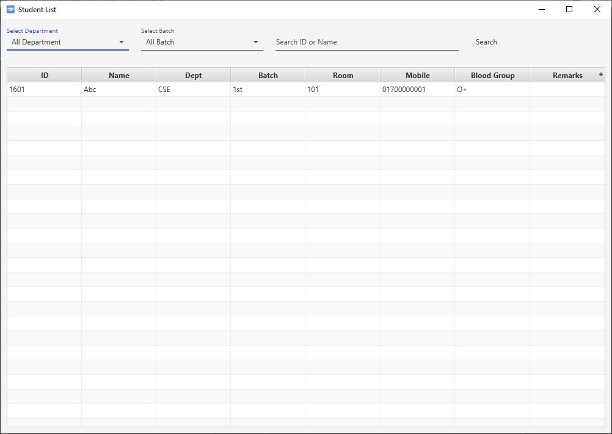
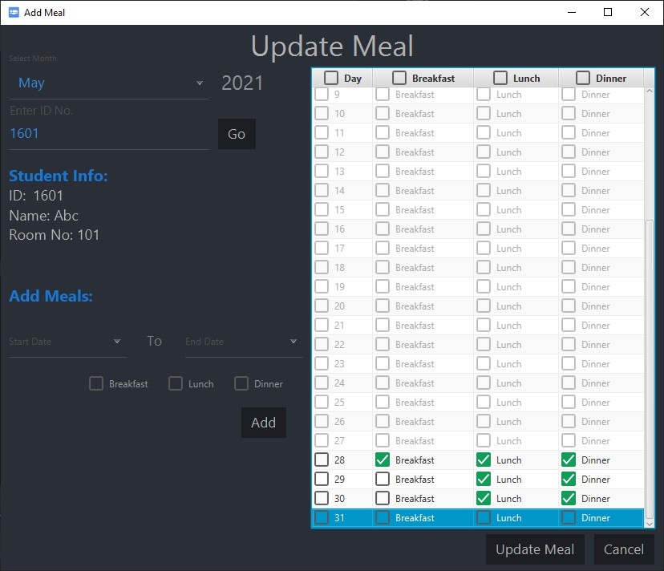
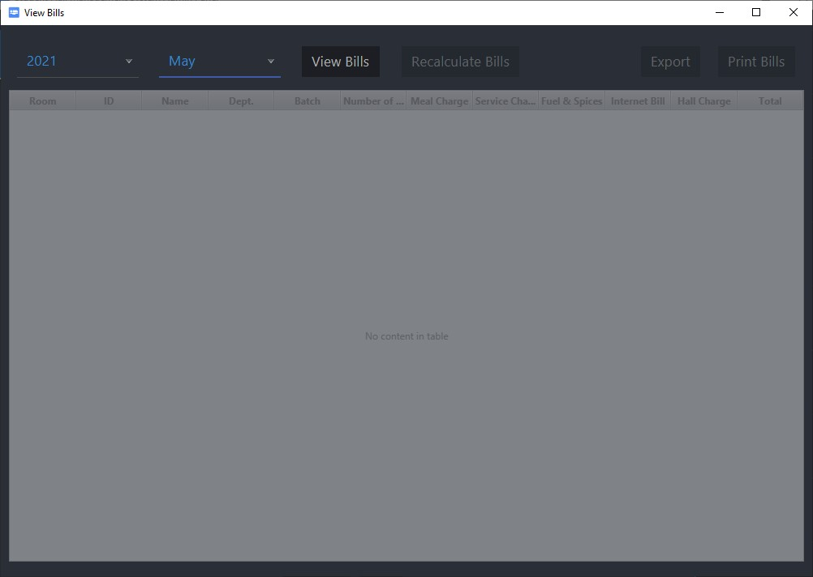
